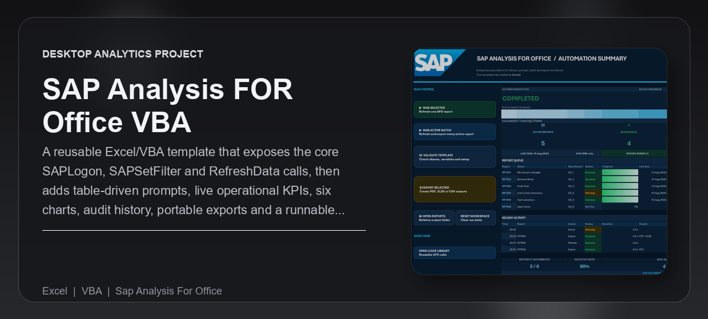
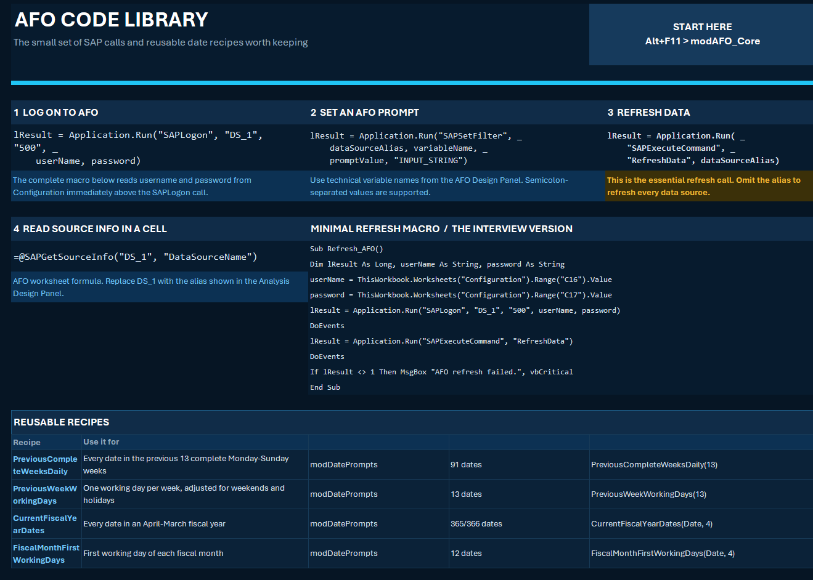
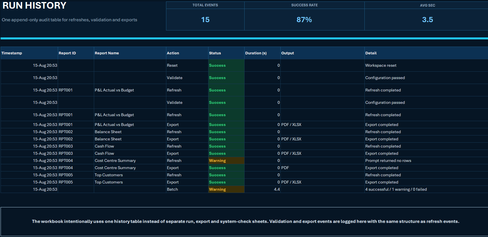
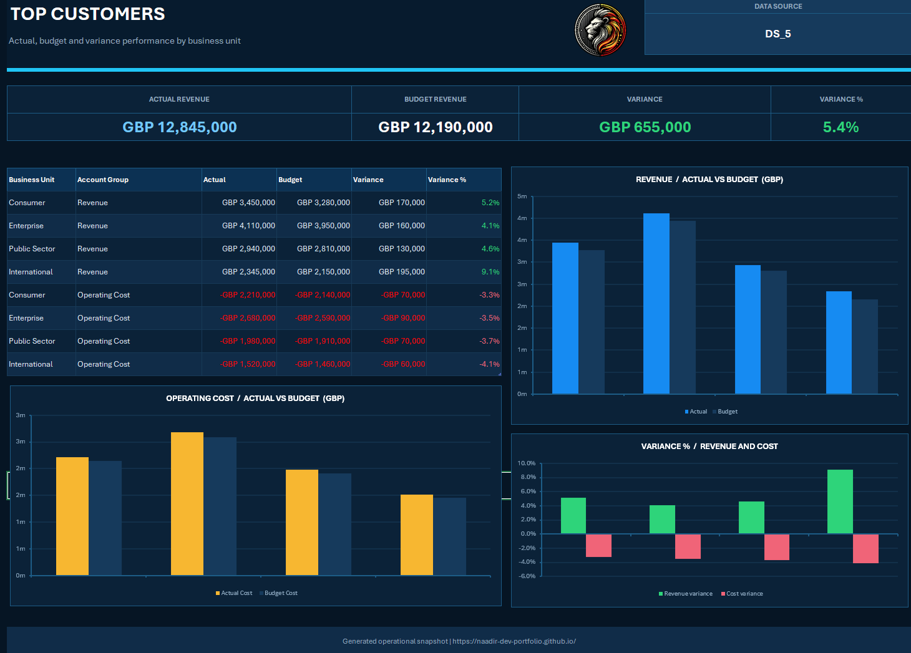

---
<div align="center">


<br /><br />

<p><strong>A reusable Excel/VBA template that exposes the core SAPLogon, SAPSetFilter and RefreshData calls, then adds table-driven prompts, live operational KPIs, six charts, audit history, portable exports and a runnable offline simulation.</strong></p>

<p>Built for reporting teams and Excel developers who need a clear, reusable way to automate SAP Analysis for Office workflows.</p>

<p>
  <a href="#overview">Overview</a> |
  <a href="#what-problem-it-solves">What It Solves</a> |
  <a href="#feature-highlights">Features</a> |
  <a href="#screenshots">Screenshots</a> |
  <a href="#quick-start">Quick Start</a> |
  <a href="#tech-stack">Tech Stack</a>
</p>

<h3><strong>Made by Naadir | August 2026</strong></h3>

</div>

---

## Overview

SAP Analysis for Office VBA Automation is a macro-enabled Excel template for running configured AFO reports from one operational Summary sheet. Users can validate the setup, refresh one report, run an active batch, monitor progress and export finished output.

The workbook keeps the core `SAPLogon`, `SAPSetFilter` and `SAPExecuteCommand` calls visible and reusable. Offline simulation runs the same prompt, status, history and export workflow without requiring AFO, while LIVE mode uses the configured SAP connection details.

The result is both a working automation template and a practical reference for future SAP reporting roles.

## What Problem It Solves

- Removes repeated manual report refresh and export steps
- Replaces one-report-at-a-time processing with a configurable batch workflow
- Makes report status, warnings, duration and export activity visible in one place
- Provides reusable AFO code instead of relying on disconnected workbook macros

### At a glance

| Track | Analyse | Compare |
|---|---|---|
| Configured reports, prompts and data sources | Success, warning and failure outcomes | Actual versus budget performance |
| Selected report and current batch state | Prompt rules, duration and refresh results | Individual report versus batch results |
| Run history and export progress | Operational charts and report tables | Current output versus configured targets |

## Feature Highlights

- **AFO integration**, exposes the real logon, prompt and refresh calls in readable VBA
- **Table-driven configuration**, controls reports, aliases, prompts and export formats without rewriting macros
- **Operational Summary**, shows progress, outcomes, recent activity and performance charts
- **Batch automation**, refreshes and exports every active report from one command
- **Offline simulation**, demonstrates the complete workflow on a computer without SAP AFO
- **Audit and exports**, records each action and creates portable PDF, XLSX or CSV output

### Core capabilities

| Area | What it gives you |
|---|---|
| **Report control** | Run one selected report or process the full active queue |
| **Prompt handling** | Apply configured values and reusable date rules to AFO variables |
| **Operational monitoring** | Review progress, outcomes, duration and recent activity from Summary |
| **Output management** | Keep an audit history and create files in a relative export folder |

## Screenshots

<details>
<summary><strong>Open screenshot gallery</strong></summary>

<br />

<div align="center">
  
  <br /><br />
  
  <br /><br />
  
</div>

</details>

## Quick Start

```bash
# Clone the repo
git clone https://github.com/Naadir-Dev-Portfolio/SAP-Analysis-for-Office-VBA-Automation.git
cd SAP-Analysis-for-Office-VBA-Automation

# Install dependencies
# No package installation is required

# Run
powershell.exe -NoProfile -Command "Start-Process './SAP_AFO_Automation_Portfolio.xlsm'"
```

Open the workbook in desktop Microsoft Excel and enable macros. No API keys are required. Leave Mode set to `SIMULATION` to run offline; LIVE mode requires SAP Analysis for Office and valid SAP credentials in Configuration.

## Tech Stack

<details>
<summary><strong>Open tech stack</strong></summary>

<br />

| Category | Tools |
|---|---|
| **Primary stack** | `VBA` |
| **UI / App layer** | Microsoft Excel dashboard, tables, charts and form controls |
| **Data / Storage** | Excel worksheets, structured tables, run history and local export files |
| **Automation / Integration** | SAP Analysis for Office VBA APIs and Excel PDF/XLSX/CSV export |
| **Platform** | Windows desktop Microsoft Excel |

</details>

## Architecture & Data

<details>
<summary><strong>Open architecture and data details</strong></summary>

<br />

### Application model

Configuration tables provide report aliases, prompt rules, connection settings and export formats. Summary commands pass the selected configuration into VBA, which validates the setup, applies prompts, runs either the AFO or simulation path, updates operational status and writes Run History. Finished report sheets can then be exported to the workbook's relative output folder.

### Project structure

```text
SAP-Analysis-for-Office-VBA-Automation/
+-- SAP_AFO_Automation_Portfolio.xlsm
+-- vba/
+-- README.md
+-- repo-card.png
+-- portfolio/
    +-- sap-analysis-for-office-vba-automation.json
    +-- sap-analysis-for-office-vba-automation.webp
    +-- Screen1.png
    +-- Screen2.png
    +-- Screen3.png
```

### Data / system notes

- The main application is a local macro-enabled Excel workbook using structured tables
- Offline simulation requires no SAP system; LIVE mode requires the AFO add-in and private credentials
- Run activity is logged inside the workbook and exports are written to a relative local folder

</details>

## Contact

Questions, feedback, or collaboration: `naadir.dev.mail@gmail.com`

<sub>VBA</sub>

---
